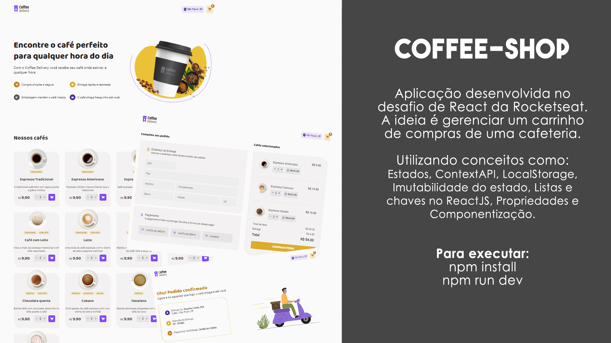

# Coffee Shop

### Sobre o projeto

Aplicação desenvolvida no desafio de React da Rocketseat. A ideia é gerenciar um carrinho de compras de uma cafeteria.

Utilizando conceitos como: Estados, ContextAPI, LocalStorage, Imutabilidade do estado, Listas chaves no ReactJS, Propriedades e Componentização.

### Para executar:
npm install
npm run dev
